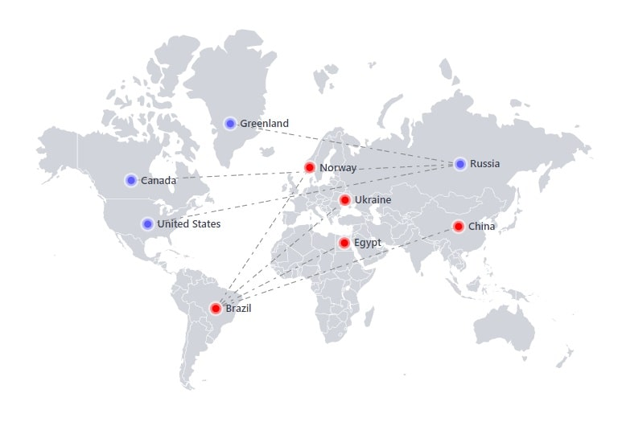

<p align="center">
  <a href="https://jvm-docs.vercel.app">
    
  </a>
</p>

<h3 align="center">Jsvectormap</h3>

<p align="center">
  A lightweight Javascript library for creating interactive maps and pretty data visualization.
  <br>
  <br>
  <a href="https://jvm-docs.vercel.app/docs/introduction"><strong>Explore docs</strong></a>
  .
  <a href="https://github.com/themustafaomar/jsvectormap/issues/new"><strong>Report bug</strong></a>
  ·
  <a href="https://jvm-docs.vercel.app"><strong>View demo</strong></a>
  ·
  <a href="https://github.com/themustafaomar/jsvectormap/archive/master.zip"><strong>Download</strong></a>
</p>

# Jsvectormap

Bringing data to life with interactive maps

This project is a deeply modified version of [jvectormap](https://github.com/bjornd/jvectormap) and was created to help developers who aren't using jQuery anymore in their projects.

Jsvectormap supports all modern browsers including IE9+

<a href="https://www.npmjs.com/package/jsvectormap"></a>
<a href="https://npmcharts.com/compare/jsvectormap?minimal=true"></a>


## What's an interactive map

* Interactive map is a powerful tool for presentation.
* It give the ability to create layers of information that can be shown or hidden at the click of a button on a region or maybe a marker.
* Data can be quickly updated, and these updates made transparent to users. 
* Zoom functions that allow users to focus on either the details of a particular region, or to gain a quick overview of a wider area.

## Quick start

Installing via npm
```bash
npm i jsvectormap
```

import your preferred map you want to work with, after importing the `jsvectormap`

```js
import jsVectorMap from 'jsvectormap'
import 'jsvectormap/dist/maps/world.js'

const map = new jsVectorMap({
  selector: '#map',
  map: 'world',
})
```

## Contributions
Your contributions always **welcome** but consider the following notes:

* The build files shouldn't be updated when sending pull requests.

## Setup
```bash
### Install node via your preferred mechanism. Ensure the binaries are in your path & obtain a copy of this repository and change into the working directory
git clone https://github.com/themustafaomar/jsvectormap.git && cd jsvectormap

# Build
npm run build

# Start up the live web server (will be available on port 10001)
npm run dev
-> http://localhost:10001/index.html

# Access and test in samples dir
-> http://localhost:10001/samples/YourSampleName.html
```

## License
jsvectormap licensed under MIT.
